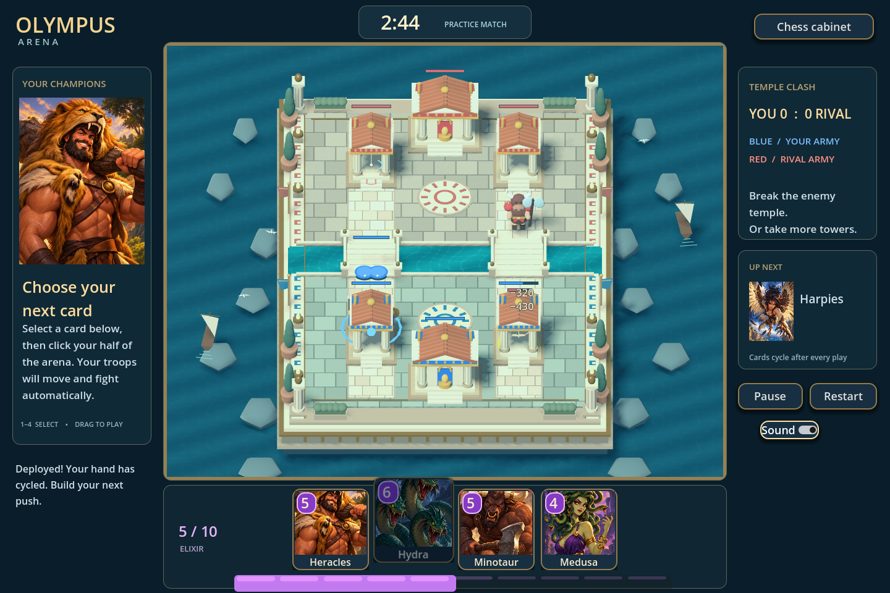

# Board Game Cabinet

**The app now opens Olympus Arena:** a playable real-time Greek arena battler with an eight-card deck, four-card hand, regenerating elixir, two bridges, two defensive towers and a central temple per side, automatic troop combat, and a tactical local computer opponent. The current polish pass adds an illustrated roster, animated coastal arena, soft crowd separation, character-specific combat effects, tower destruction, tactile card dragging, reactive match HUD, countdown, and an original synthesized lyre-and-frame-drum score. Troops, spells, cards, audio, effects, and the 3D arena are original project assets. The core match structure follows the user's requested Clash Royale reference.

Press **BATTLE**, select a card with a click or keys **1–4**, then click your half of the arena. Cards can also be dragged onto the arena. **Thunderbolt** targets either side. **Space** pauses/resumes the local match; **Escape** deselects a card. Destroy the rival temple to win immediately, or win on towers at the clock. The final minute doubles elixir regeneration. A tied three-minute match enters up to one minute of sudden-death overtime.

The first roster is **Hoplites, Atalanta, Minotaur, Medusa, Heracles, Hydra, Harpies, and Thunderbolt**. This is a local playable prototype with a fixed deck and basic bot, not online multiplayer or a progression system. See the [arena guide](docs/OLYMPUS_ARENA.md), [exact rules](games/olympus_arena/RULES.md), and [current handoff](docs/HANDOFF.md). The Ninth Gate remains a parked historical experiment; Go, Xiangqi, and checkers have not been implemented.



## Wooden chess table

A playable Godot desktop chess table with a wooden board, round wooden chips, and burned-symbol shading. The app separates authoritative chess state from 3D presentation and uses reusable theme Resources so the simple static set can become a foundation for more sets and, later, other games.

The current build includes legal chess moves and special moves, turn handling, legal/capture/check/last-move indicators, four-choice promotion, SAN move history, undo, immutable position review, transactional save/load, a two-ply local practice opponent, and factual tutor context with candidate moves. Chips lift, slide, and settle; wooden taps can be muted. The board supports mouse and keyboard play, screen-relative navigation in either orientation, and persisted table preferences. Full games can be copied or exported as PGN, and draw claims can declare an intended move without playing it.

The [production plan](docs/PLAN.md) contains the architecture, full acceptance gates, 35 original parallel slices, their delivery status, and practical next slices. [Verification notes](docs/VERIFICATION.md) separate automated coverage, inspected graphics, exported-app checks, and remaining product limitations.

## Run and controls

Tested on **Godot 4.3**, Windows, using the Compatibility/OpenGL renderer with an NVIDIA RTX 4070. Open `project.godot` in that Godot version and run the project, or run this from the repository root with Godot on your PATH:

```powershell
godot --path .
```

The default scene is Olympus Arena. Choose **Chess cabinet** to reach the wooden table; the controls below apply to that chess scene.

- Click a piece, then one of its legal destinations. Promotion opens a queen/rook/bishop/knight choice.
- Press **Tab** until the board has focus, use **arrow keys** to move the square cursor, and **Enter** or **Space** to select a piece and play a legal destination. Arrows follow the visible board in either orientation. **Escape** clears selection. Promotion choices also support keyboard focus and activation.
- Use the opponent selector for local play or the practice computer.
- **Undo**, **New**, **Save**, **Load**, and **Claim draw** operate on the authoritative session. The draw dialog offers supported current-position claims and qualifying intended moves. Declaring a move claims the draw without adding that move to the played history.
- **Turn board**, or **F**, changes viewing orientation. **Escape** clears selection.
- **‹** and **›** inspect recorded positions; **Live** returns to the current game. Review does not mutate the active position.
- **Explore a candidate move** requests a practice-level suggestion.
- **Copy PGN** copies the full live game record; **Export PGN…** opens a file chooser. A historical review position does not truncate the record.
- **Table settings…** contains **Wooden move sound** and **Reduced motion** controls.

Save/Load uses one local save slot at `user://cabinet-chess-v1.json`. An invalid save leaves the active game intact. Sound, board orientation, reduced motion and opponent mode are remembered separately in a versioned local preference file. Zoom is not persisted. Invalid preferences fall back to usable defaults.

## Verify

From the repository root in PowerShell:

```powershell
./tools/verify.ps1 -Godot "C:/path/to/Godot_v4.3-stable_win64_console.exe"
./tools/verify.ps1 -Godot "C:/path/to/Godot_v4.3-stable_win64_console.exe" -Graphics
```

The first command imports the project and runs five headless suites: `test_chess`, `test_chess_oracle`, `test_session`, `test_draw_claims` and `test_pgn`. `-Graphics` also runs `test_board`, `test_app` and `test_controls` in the Compatibility renderer and needs a usable graphics session. The complete command passed on the tested Windows system.

The oracle fixture was generated with python-chess 1.11.2 and compares **960 positions and 23,179 legal moves**. The board suite passed **136 checks**. Application integration coverage includes mouse moves, the computer response, save and corrupt-load recovery, undo, castling, en passant, underpromotion, and position review. PGN export has 176 default-run checks plus 14 independently parsed replay fixtures. Controls coverage adds keyboard navigation, promotion, preferences, reduced motion, PGN export and draw dialogs. These checks establish specific behavior; they do not prove every chess position, universal dead-position adjudication, or complete product accessibility.

GitHub CI passed for the implemented checkpoint `35220cb`: [verification run](https://github.com/dancockrell/board-game-cabinet/actions/runs/33965654203). Check the latest repository run before assuming that result applies to later changes.

## Export for Windows

Install Godot 4.3's matching export templates through the editor's export-template manager. The checked-in **Windows Desktop** preset produces an x86-64 executable with its PCK embedded. From the repository root:

```powershell
New-Item -ItemType Directory -Force build | Out-Null
godot --headless --path . --export-release "Windows Desktop" "build/BoardGameCabinet.exe"
./build/BoardGameCabinet.exe
```

Replace `godot` with your quoted executable path and PowerShell's `&` invocation operator if it is not on PATH. The Windows export was built, opened, and captured on the tested machine. This preset is not code-signed; broader platform exports are not verified.

## Current boundaries

The computer is a local two-ply practice opponent, not Stockfish or a UCI engine connection. Tutor output provides position facts and heuristic candidates; expert tactical explanations and conversational coaching are pending. SAN and standard-start PGN export are implemented; PGN import remains pending. See [PGN scope](docs/PGN.md).

Draw claims support the current position and a declared legal next move, with the declaration retained in saves. Generic dead-position detection beyond the supported material cases remains pending. Xiangqi remains an architectural target. Multiple save slots and a complete accessibility review remain open; screen-reader behavior has not been validated. The branded effect includes restrained height-normal shading on the chip top; physically recessed silhouette geometry remains future work.

## Design boundaries

- Rules and state are `RefCounted` objects. Core legality never depends on a Node.
- The session accepts moves, records history, and owns the position. The board renders that state and submits requests.
- Board/piece themes are Godot Resources. Appearance changes must preserve the position and legal moves.
- Chess is concrete first. Xiangqi will introduce intersection topology and its own rules without forcing chess assumptions into a universal base class.
- Computer and tutor adapters return identified, position-bound results. Obsolete responses are rejected and proposed moves revalidated.

See `AGENTS.md` before collaborating. Work in independently owned slices, stage only your files, and keep commits small. Inspect the actual running board when assessing visual changes.
